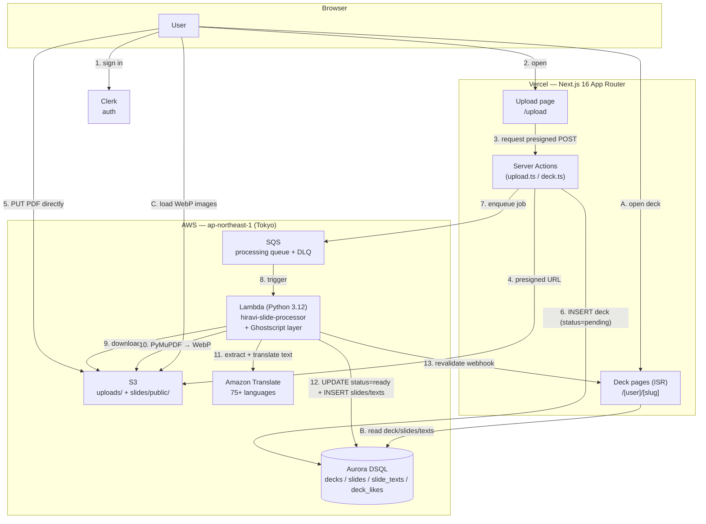
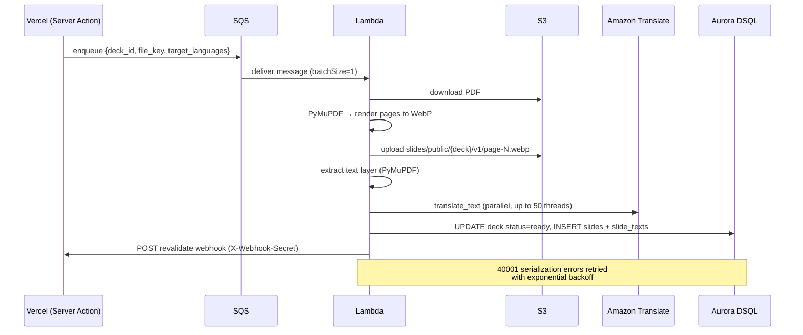

# Hiravi 🌐

[日本語版 (README_ja.md)](./README_ja.md)

**Global Slide Sharing Platform with Instant Multi-Language Translation**

> H0 Hackathon 2026 — Track 3: Million-scale Global App

## What is Hiravi?

Upload a PDF slide deck → Get a web-native slideshow with automatic translations in 75+ languages. The original slide images are never modified — translations are stored as a separate reference layer alongside the source text.

**Name**: ひらり (paper fluttering) + visual + 開く (*hiraku*, to open)

## Architecture



**Processing pipeline (sequence)**



## Tech Stack

| Layer | Technology | Notes |
|---|---|---|
| Frontend | Next.js 16 (App Router), React 19, Tailwind CSS, shadcn/ui | Server Actions for all AWS calls |
| Hosting | Vercel (ISR + Web Analytics + Speed Insights) | Slide pages cached, revalidated by webhook |
| Database | **Aurora DSQL** (multi-region serverless PostgreSQL) | Accessed via `pg` + `@aws-sdk/dsql-signer` (IAM auth token) |
| Auth | Clerk (`@clerk/nextjs`) | OAuth, sessions; anonymous likes via signed cookie |
| Storage | Amazon S3 (versioned, encrypted, CORS-scoped) | Direct browser upload via presigned POST; public slides under `slides/public/*` |
| Queue | Amazon SQS + Dead Letter Queue | Decouples upload from heavy processing |
| Compute | AWS Lambda (Python 3.12, 2 GB, 15 min) | PyMuPDF for render/extract, Ghostscript layer |
| Translation | Amazon Translate (75+ languages) | `SourceLanguageCode=auto`, parallelized per slide×language |
| Observability | AWS X-Ray, Sentry | Active tracing on Lambda |
| IaC | AWS CDK (TypeScript, 6 stacks) | See [`src/README.md`](./src/README.md) |

> **Upload limits** are enforced server-side by the S3 presigned POST `content-length-range` condition (tamper-proof), not a separate rate limiter.

## Repository Structure

```text
.
├── README.md                 # This file (English)
├── README_ja.md              # Japanese version
├── Makefile                  # install / synth / deploy / frontend-dev / sync-env
├── frontend/                 # Next.js 16 app (deployed to Vercel)
│   ├── app/                  # App Router: pages, Server Actions, route handlers
│   │   ├── actions/          # upload.ts, deck.ts (Server Actions)
│   │   ├── [user]/[slug]/    # public deck viewer
│   │   └── s/[code]/         # short-id redirect
│   ├── components/           # UI (deck-viewer, browse, shadcn/ui)
│   └── lib/                  # db.ts (DSQL), data.ts, upload-limits.ts
├── src/                      # AWS CDK infrastructure (TypeScript)
│   ├── bin/                  # CDK app entry point
│   ├── lib/                  # 6 stack definitions
│   ├── lambda/processing/    # handler.py (PDF processor)
│   ├── layers/ghostscript/   # Lambda layer
│   ├── schema/schema.sql     # Aurora DSQL schema
│   └── scripts/              # one-off DB migration helpers
└── docs/                     # Knowledge base & references — see docs/README.md
```

## Data Model (Aurora DSQL)

| Table | Purpose |
|---|---|
| `decks` | Deck metadata, status (`pending`→`ready`/`failed`), counters, soft-delete (`deleted_at`) |
| `slides` | One row per page, ordered by `page_number`, points to S3 `image_key` |
| `slide_texts` | Per-slide text keyed by `language_code` (`original` + each target language) |
| `deck_likes` | Composite PK `(deck_id, liker_id)` — Clerk user id or `anon:<uuid>` cookie id |

> DSQL does not support `TEXT[]`; array-like fields (`tags`, `target_languages`) use `JSONB`. Indexes are created with `CREATE INDEX ASYNC`.

## Key Design Decisions

1. **Decoupled async processing** — `S3 → SQS → Lambda` keeps the upload request fast; heavy PDF→image→translate work runs out-of-band (`batchSize=1`, `maxConcurrency=10`).
2. **Direct-to-S3 upload** — Browsers `PUT` straight to S3 via a presigned POST, so large PDFs never pass through Vercel functions. The `content-length-range` condition enforces the size cap server-side.
3. **Translation as a separate layer** — Original slide images are never altered; translations live in `slide_texts` and render as an optional reference layer.
4. **IAM auth token for DSQL** — No static DB password; `@aws-sdk/dsql-signer` mints a short-lived token per connection.
5. **OCC handled, not avoided** — Aurora DSQL is optimistic-concurrency; the Lambda retries `40001` serialization failures with exponential backoff rather than relying on locks.
6. **Least-privilege credentials** — The Vercel IAM user is scoped to S3 put/get/delete, SQS send, and DSQL connect only; its access key is stored in Secrets Manager (never in CloudFormation outputs).

## Getting Started

```bash
# 1. Deploy AWS infrastructure (CDK)
make install        # cd src && npm install
make synth          # generate CloudFormation
make deploy         # cdk deploy --all

# 2. Frontend (Vercel)
make frontend-install   # cd frontend && pnpm install
make frontend-dev       # local dev server
make frontend-deploy    # sync env + vercel --prod
```

Apply the database schema with the helpers in `src/scripts/` (see [`src/README.md`](./src/README.md)).

## Documentation

| Doc | Contents |
|---|---|
| [`README_ja.md`](./README_ja.md) | Japanese version of this README |
| [`src/README.md`](./src/README.md) | CDK stacks, deployment, security notes |
| [`docs/README.md`](./docs/README.md) | Knowledge base index (per-technology references) |
| [`docs/REFERENCE.md`](./docs/REFERENCE.md) | Hackathon rules & judging criteria |
| [`PROMPT.md`](./PROMPT.md) | Full original project specification |

## License

MIT

---

Built for [H0: Hack the Zero Stack](https://h01.devpost.com/) with Vercel v0 and AWS Databases.

**#H0Hackathon**
