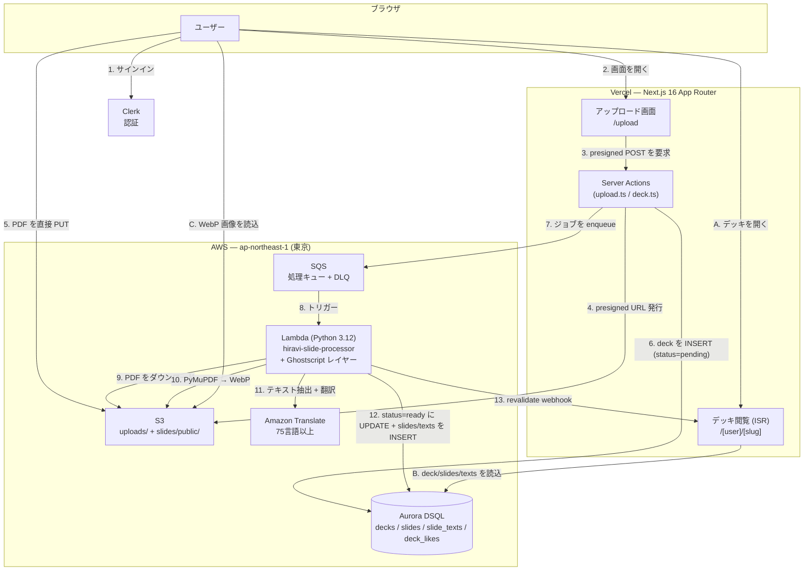
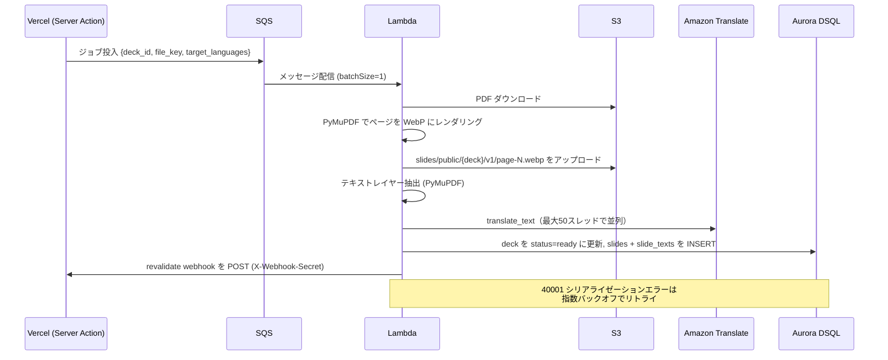

# Hiravi 🌐

[English (README.md)](./README.md)

**スライド共有 + 自動多言語翻訳プラットフォーム**

> H0 Hackathon 2026 — Track 3: Million-scale Global App

## Hiravi とは？

PDF スライドをアップロードするだけで、75言語以上に自動翻訳された Web スライドショーが完成。元のスライド画像は一切改変せず、翻訳と原文テキストは「参考レイヤー」として別管理します。

**名前の由来**: ひらり（紙が軽やかにめくれる様）+ visual + 開く（*hiraku*）

## アーキテクチャ



**処理パイプライン（シーケンス）**



## 技術スタック

| レイヤー | 技術 | 補足 |
|---|---|---|
| フロントエンド | Next.js 16 (App Router), React 19, Tailwind CSS, shadcn/ui | AWS 呼び出しはすべて Server Actions 経由 |
| ホスティング | Vercel (ISR + Web Analytics + Speed Insights) | スライドページをキャッシュ、webhook で再検証 |
| データベース | **Aurora DSQL**（マルチリージョン・サーバーレス PostgreSQL） | `pg` + `@aws-sdk/dsql-signer`（IAM 認証トークン）で接続 |
| 認証 | Clerk (`@clerk/nextjs`) | OAuth・セッション。匿名いいねは署名付き Cookie |
| ストレージ | Amazon S3（バージョニング・暗号化・CORS 制限） | presigned POST でブラウザから直接アップロード。公開スライドは `slides/public/*` |
| キュー | Amazon SQS + Dead Letter Queue | アップロードと重い処理を分離 |
| コンピュート | AWS Lambda (Python 3.12, 2GB, 15分) | PyMuPDF で画像化/抽出、Ghostscript レイヤー |
| 翻訳 | Amazon Translate（75言語以上） | `SourceLanguageCode=auto`、スライド×言語で並列実行 |
| 監視 | AWS X-Ray, Sentry | Lambda で Active トレーシング |
| IaC | AWS CDK (TypeScript, 6スタック) | [`src/README.md`](./src/README.md) 参照 |

> **アップロード上限**は別途のレート制限ではなく、S3 presigned POST の `content-length-range` 条件でサーバー側強制（クライアント改ざん不可）。

## リポジトリ構成

```text
.
├── README.md                 # 英語版
├── README_ja.md              # 本ファイル（日本語版）
├── Makefile                  # install / synth / deploy / frontend-dev / sync-env
├── frontend/                 # Next.js 16 アプリ（Vercel デプロイ）
│   ├── app/                  # App Router: ページ・Server Actions・Route Handler
│   │   ├── actions/          # upload.ts, deck.ts（Server Actions）
│   │   ├── [user]/[slug]/    # 公開デッキビューア
│   │   └── s/[code]/         # short-id リダイレクト
│   ├── components/           # UI（deck-viewer, browse, shadcn/ui）
│   └── lib/                  # db.ts (DSQL), data.ts, upload-limits.ts
├── src/                      # AWS CDK インフラ（TypeScript）
│   ├── bin/                  # CDK アプリのエントリポイント
│   ├── lib/                  # 6スタック定義
│   ├── lambda/processing/    # handler.py（PDF 処理）
│   ├── layers/ghostscript/   # Lambda レイヤー
│   ├── schema/schema.sql     # Aurora DSQL スキーマ
│   └── scripts/              # DB マイグレーション用ヘルパー
└── docs/                     # ナレッジ & 参考資料 — docs/README.md 参照
```

## データモデル (Aurora DSQL)

| テーブル | 役割 |
|---|---|
| `decks` | デッキのメタ情報・ステータス（`pending`→`ready`/`failed`）・カウンタ・論理削除（`deleted_at`） |
| `slides` | 1ページ1行。`page_number` 順、S3 の `image_key` を保持 |
| `slide_texts` | スライドごとのテキストを `language_code` 別に保持（`original` + 各翻訳言語） |
| `deck_likes` | 複合主キー `(deck_id, liker_id)` — Clerk user_id または `anon:<uuid>` Cookie ID |

> DSQL は `TEXT[]` 非対応のため、配列的な項目（`tags`, `target_languages`）は `JSONB`。インデックスは `CREATE INDEX ASYNC` で作成。

## 主要な設計判断

1. **非同期処理の分離** — `S3 → SQS → Lambda` でアップロード要求を高速に保ち、重い PDF→画像→翻訳処理は別系統（`batchSize=1`, `maxConcurrency=10`）。
2. **S3 への直接アップロード** — presigned POST でブラウザから S3 へ直接 `PUT`。大きな PDF が Vercel 関数を通らない。サイズ上限は `content-length-range` でサーバー側強制。
3. **翻訳は別レイヤー** — 元のスライド画像は改変せず、翻訳は `slide_texts` に保存し参考レイヤーとして表示。
4. **DSQL は IAM 認証トークン** — 固定 DB パスワードを持たず、`@aws-sdk/dsql-signer` が接続ごとに短命トークンを発行。
5. **OCC は「回避」でなく「対処」** — Aurora DSQL は楽観的並行制御。Lambda はロックに頼らず `40001` を指数バックオフでリトライ。
6. **最小権限の認証情報** — Vercel 用 IAM ユーザーは S3 put/get/delete・SQS send・DSQL connect のみに限定。アクセスキーは Secrets Manager 管理（CloudFormation Outputs に平文出力しない）。

## はじめ方

```bash
# 1. AWS インフラのデプロイ (CDK)
make install        # cd src && npm install
make synth          # CloudFormation 生成
make deploy         # cdk deploy --all

# 2. フロントエンド (Vercel)
make frontend-install   # cd frontend && pnpm install
make frontend-dev       # ローカル開発サーバー
make frontend-deploy    # env 同期 + vercel --prod
```

DB スキーマの適用は `src/scripts/` のヘルパーを使用（[`src/README.md`](./src/README.md) 参照）。

## ドキュメント

| ドキュメント | 内容 |
|---|---|
| [`README.md`](./README.md) | 本 README の英語版 |
| [`src/README.md`](./src/README.md) | CDK スタック・デプロイ・セキュリティ |
| [`docs/README.md`](./docs/README.md) | ナレッジ索引（技術別リファレンス） |
| [`docs/REFERENCE.md`](./docs/REFERENCE.md) | ハッカソンのルール・審査基準 |
| [`PROMPT.md`](./PROMPT.md) | プロジェクト仕様（原本） |

## ライセンス

MIT

---

[H0: Hack the Zero Stack](https://h01.devpost.com/) のために Vercel v0 と AWS Databases で構築。

**#H0Hackathon**
