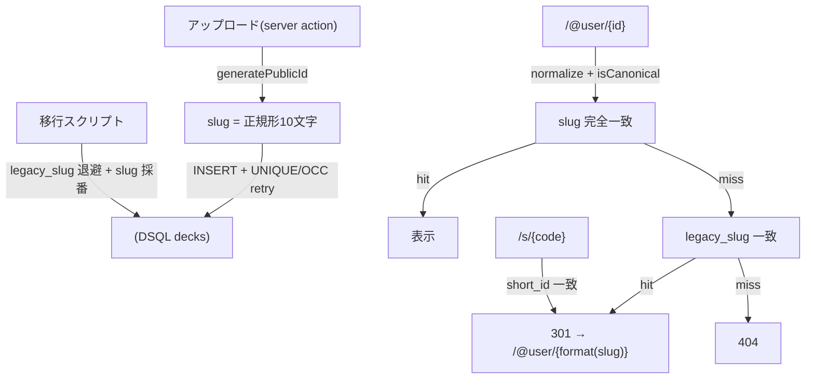

# ビジネスロジックモデル — slug-identifier

## コア関数（技術非依存の擬似仕様）

### generatePublicId(): string
```
ALPHABET = "abcdefghijklmnopqrstuvwxyz"
return nanoid(ALPHABET, 10)   // 正規形（ハイフン無し10文字）
```

### formatPublicId(canonical): string
```
require canonical matches ^[a-z]{10}$
return canonical[0:3] + "-" + canonical[3:7] + "-" + canonical[7:10]
```

### normalizePublicId(input): string
```
return lowercase(removeAll(input, "-"))
```

### isCanonicalId(s): boolean
```
return s matches ^[a-z]{10}$
```

## ユースケース1: デッキ作成（採番）
```
createDeckRecord(params):
    attempt = 0
    loop:
        publicId = generatePublicId()
        try:
            INSERT INTO decks (id, slug, legacy_slug, short_id, title, ...)
                 VALUES (params.deckId, publicId, NULL, NULL, params.title, ...)
            return { slug: publicId, displaySlug: formatPublicId(publicId) }
        catch e where isUniqueViolation(e) or isOccConflict(e):
            attempt += 1
            if attempt >= MAX_RETRIES (=5): throw GenerationFailedError
            continue   // 別IDで再試行
        catch e:
            throw e     // 非リトライ系はそのまま送出
```

## ユースケース2: 閲覧（主URL解決） `/@{user}/{idOrSlug}`
```
resolveDeck(user, idOrSlug):
    norm = normalizePublicId(idOrSlug)
    if isCanonicalId(norm):
        deck = SELECT ... WHERE user_id = user AND slug = norm AND deleted_at IS NULL
        if deck: return RENDER(deck)            // 正規ヒット
    // フォールバック: 旧タイトルslug
    legacy = SELECT ... WHERE user_id = user AND legacy_slug = idOrSlug AND deleted_at IS NULL
    if legacy: return REDIRECT_301("/@" + user + "/" + formatPublicId(legacy.slug))
    return NOT_FOUND_404
```

## ユースケース3: ショートURL（レガシー） `/s/{code}`
```
resolveShort(code):
    deck = SELECT user_id, slug FROM decks WHERE short_id = code AND deleted_at IS NULL
    if deck: return REDIRECT_301("/@" + deck.user_id + "/" + formatPublicId(deck.slug))
    return NOT_FOUND_404
```

## ユースケース4: 既存データ移行（冪等・後付け採番）
```
migrate():
    rows = SELECT id, slug FROM decks WHERE deleted_at IS NULL
    for row in rows:
        if isCanonicalId(row.slug): continue          // 既移行はスキップ（冪等）
        attempt = 0
        loop:
            newId = generatePublicId()
            try:
                UPDATE decks
                   SET legacy_slug = row.slug, slug = newId, updated_at = NOW()
                 WHERE id = row.id
                break
            catch e where isUniqueViolation(e) or isOccConflict(e):
                attempt += 1
                if attempt >= MAX_RETRIES: log.warn("skip", row.id); break
                continue
    // short_id は既存値をそのまま温存（リダイレクト用）
```

## データフロー


## 不変条件・性質（テスト観点）
- `normalizePublicId(formatPublicId(c)) === c`（往復一致）
- `generatePublicId()` の戻り値は常に `isCanonicalId` を満たす
- 移行は冪等: `migrate()` を複数回実行しても、既移行デッキの `slug`/`legacy_slug` は不変
- 寛容ルックアップ: `resolveDeck(u, format(c))` と `resolveDeck(u, c)` は同一デッキに解決
