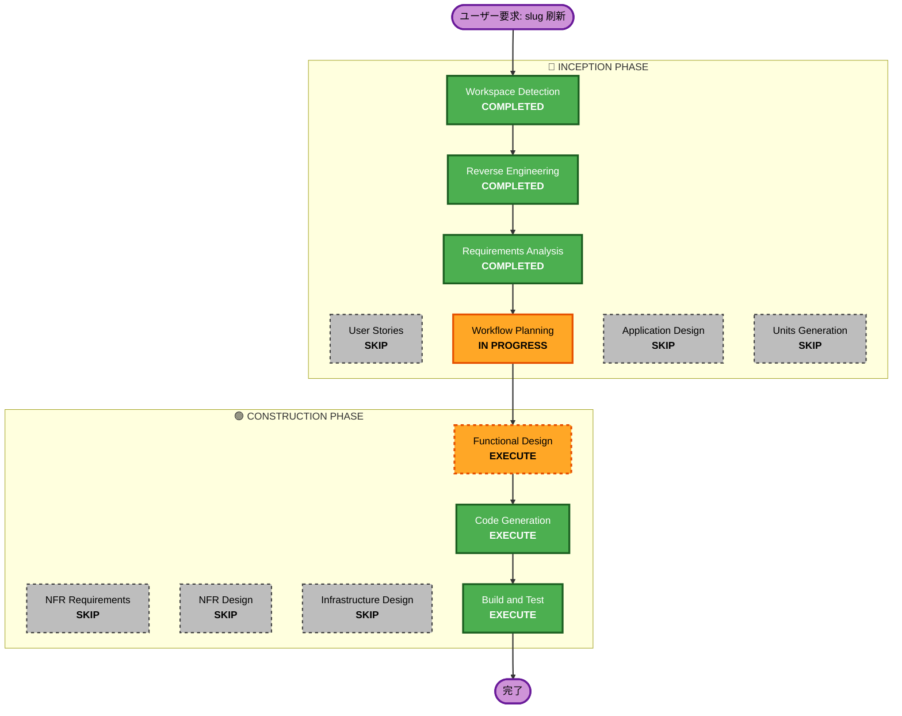

# 実行計画 — 公開識別子（Google Meet 形式 slug）の刷新

## 詳細分析サマリ

### Transformation Scope（Brownfield）
- **Transformation Type**: Single component change（アプリケーション層中心）
- **Primary Changes**: デッキ公開識別子を Google Meet 形式（小文字英字10文字・3-4-3）のランダム ID に一本化。`slug`（タイトルベース）と `short_id`（8桁hex）を統廃合。
- **Related Components**: frontend（Next.js / server action / 動的ルート）、DSQL スキーマ（`decks` テーブル）、既存データ移行スクリプト。

### Change Impact Assessment
- **User-facing changes**: Yes — 公開URLの形式が変わる（`/@{user}/{title-slug}` → `/@{user}/{meet-id}`）。旧URLはリダイレクト維持。
- **Structural changes**: No — システムアーキテクチャ（Vercel/S3/SQS/Lambda/DSQL）は不変。
- **Data model changes**: Yes — `decks` テーブルの識別子カラム（`slug`/`short_id`）と UNIQUE 制約の見直し。
- **API changes**: Yes（内部のみ）— server action `createDeckRecord` の採番ロジック、閲覧ルートのルックアップ。外部APIコントラクトの変更なし。
- **NFR impact**: Yes — 衝突確率・推測耐性・DSQL OCC リトライ（requirements.md の NFR-1〜5 で定義済み）。

### Component Relationships（Brownfield）
- **Primary Component**: `frontend`（`app/actions/upload.ts`, `app/[user]/[slug]/page.tsx`, `app/s/[code]/route.ts`）
- **Shared Components**: `src/schema/schema.sql`（DSQL スキーマ定義）、`frontend/lib/db`（DB アクセス）
- **Infrastructure Components**: なし（既存 DSQL を利用、新規プロビジョニングなし）
- **Dependent Components**: 既存デッキデータ（移行対象）
- **Supporting Components**: 移行スクリプト（新規）

| 関連コンポーネント | Change Type | Change Reason | Priority |
|---|---|---|---|
| `frontend/app/actions/upload.ts` | Major | 採番ロジック置き換え | Critical |
| `src/schema/schema.sql` | Minor | カラム/制約見直し | Critical |
| `frontend/app/[user]/[slug]/page.tsx` | Minor | ルックアップを Meet形式/寛容一致へ | Critical |
| `frontend/app/s/[code]/route.ts` | Minor | ショートURL の再設計 or 廃止 | Important |
| 移行スクリプト（新規） | Major | 既存デッキの後付け採番＋旧URLリダイレクト | Important |

### Risk Assessment
- **Risk Level**: Medium — DBスキーマ（UNIQUE制約）・公開URL・既存データ移行・後方互換リダイレクトに跨る。
- **Rollback Complexity**: Moderate — スキーマ変更と移行を伴うため、ロールバックは旧カラム保持で緩和。
- **Testing Complexity**: Moderate — 生成/正規化/寛容ルックアップ/衝突リトライ/移行冪等性の検証が必要。

---

## ワークフロー可視化

---

## Phases to Execute

### 🔵 INCEPTION PHASE
- [x] Workspace Detection (COMPLETED)
- [x] Reverse Engineering (COMPLETED)
- [x] Requirements Analysis (COMPLETED)
- [x] User Stories (SKIPPED)
- [x] Execution Plan (IN PROGRESS)
- [ ] Application Design — **SKIP**
  - **Rationale**: 新規コンポーネント/サービス・新規メソッドなし。既存コンポーネント境界内の変更のため。
- [ ] Units Planning — **SKIP**
  - **Rationale**: 単一のまとまった変更。複数ユニットへの分解は不要。
- [ ] Units Generation — **SKIP**
  - **Rationale**: 分解不要のため。

### 🟢 CONSTRUCTION PHASE
- [ ] Functional Design — **EXECUTE（軽量）**
  - **Rationale**: `decks` テーブルのスキーマ差分、ID生成/正規化（ハイフン）、寛容ルックアップ、衝突リトライ、既存データ移行のロジックを確定させる価値がある。
- [ ] NFR Requirements — **SKIP**
  - **Rationale**: 衝突確率・推測耐性・DSQL OCC は requirements.md（NFR-1〜5）で確定済み。新規技術選定なし。
- [ ] NFR Design — **SKIP**
  - **Rationale**: NFR Requirements をスキップするため。設計は Functional Design に内包。
- [ ] Infrastructure Design — **SKIP**
  - **Rationale**: 新規クラウドリソースなし。既存 DSQL のスキーマ変更のみで、インフラ構成は不変。
- [ ] Code Generation — **EXECUTE（必須）**
  - **Rationale**: スキーマ・採番ロジック・ルーティング・移行スクリプトの実装が必要。
- [ ] Build and Test — **EXECUTE（必須）**
  - **Rationale**: 生成/正規化/寛容ルックアップ/衝突リトライ/移行冪等性の検証が必要。

### 🟡 OPERATIONS PHASE
- [ ] Operations — PLACEHOLDER

---

## Package Change Sequence（Brownfield）
1. `src/schema/schema.sql` — 識別子カラム/UNIQUE 制約を先に確定（後続の採番・ルックアップが依存）。
2. `frontend/app/actions/upload.ts` — 採番（生成＋正規化）ロジックを実装。
3. `frontend/app/[user]/[slug]/page.tsx` / `frontend/app/s/[code]/route.ts` — ルックアップ・リダイレクトを新形式へ。
4. 移行スクリプト — 既存デッキの後付け採番＋旧URLリダイレクト（最後に冪等実行）。

## Estimated Timeline
- **Total Phases（実行）**: 4（Execution Plan, Functional Design, Code Generation, Build and Test）
- **Estimated Duration**: 小〜中規模（1ユニット）。設計は軽量、実装＋移行＋テストが中心。

## Success Criteria
- **Primary Goal**: デッキの公開識別子を Google Meet 形式ランダム ID に安全に一本化する。
- **Key Deliverables**: スキーマ更新／採番・正規化・寛容ルックアップ実装／旧URLリダイレクト／既存データ移行スクリプト／テスト。
- **Quality Gates**:
  - 生成 ID が `^[a-z]{10}$`（正規形）/ 表示が `3-4-3` であること
  - ハイフン有無いずれでも同一デッキへ解決すること
  - UNIQUE 違反・OCC コンフリクト時に再生成リトライで成功すること
  - 旧URL（タイトルslug / short_id）が新URLへリダイレクトすること
  - 移行スクリプトが冪等であること
- **Integration Testing**: アップロード → 採番 → 閲覧 → 旧URLリダイレクトの一連が動作すること
