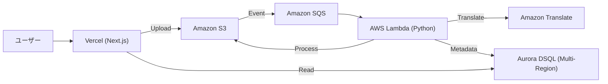
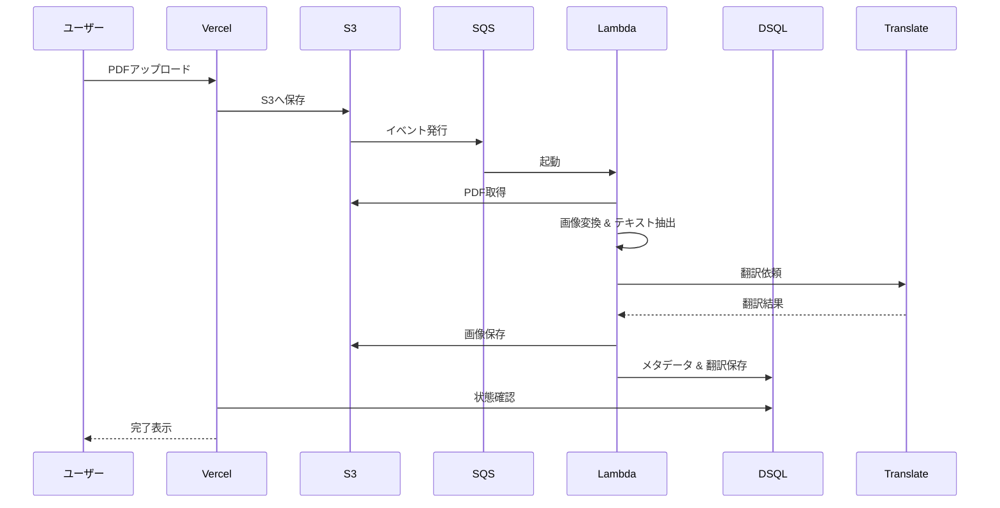

# システムアーキテクチャ

## システム概要
Hiraviは、Vercel (Frontend) と AWS (Backend) を組み合わせた、グローバルスケーラブルなサーバーレスアーキテクチャを採用しています。Aurora DSQLを使用することで、マルチリージョンでのActive-Activeなデータアクセスを実現しています。

## アーキテクチャ図

## コンポーネント説明
### S3 (Storage)
- **目的**: 元のPDF、変換後のWebP画像、およびその他のアセットを保存する。
- **責務**: 高耐久なデータストレージの提供。
- **依存関係**: Lambda (書込), Vercel (読込)
- **タイプ**: Infrastructure

### SQS (Queue)
- **目的**: フロントエンドからのアップロードとバックエンドの処理を疎結合にする。
- **責務**: 処理要求のバッファリングとリトライ管理。
- **依存関係**: S3 (イベントソース), Lambda (トリガー)
- **タイプ**: Infrastructure

### Lambda (Compute)
- **目的**: 重いPDF処理と翻訳ロジックを非同期で実行する。
- **責務**: 画像変換、OCR/テキスト抽出、翻訳APIの呼び出し。
- **依存関係**: S3, Translate, DSQL, SQS
- **タイプ**: Application

### Aurora DSQL (Database)
- **目的**: デッキのメタデータ、ページ情報、翻訳テキストを保存する。
- **責務**: グローバルな低レイテンシ読み書きとシリアライザブルな一貫性の提供。
- **依存関係**: Lambda (書込), Vercel (読込)
- **タイプ**: Infrastructure

## データフロー

## 統合ポイント
- **External APIs**: Amazon Translate (自動翻訳用), Clerk (認証用)
- **Databases**: Aurora DSQL (PostgreSQL互換)
- **Third-party Services**: Vercel (ホスティング)
