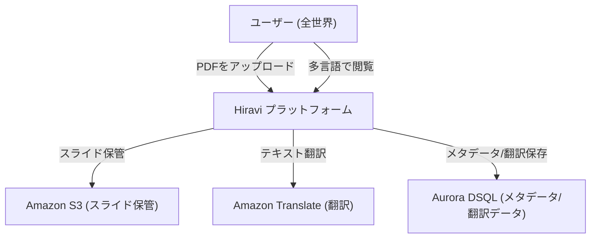

# ビジネス概要

## ビジネスコンテキスト図

## ビジネス説明
- **ビジネス概要**: Hiravi（ひらり + visual）は、言語の壁を越えて知識を共有するためのグローバルなスライド共有プラットフォームです。PDFスライドをアップロードすると、元のレイアウトを維持したまま、75以上の言語で閲覧可能なウェブネイティブなスライドショーを即座に生成します。
- **ビジネス・トランザクション**:
    - **スライドアップロード**: ユーザーがPDFファイルをアップロードし、メタデータ（タイトル、カテゴリ、対象言語など）を設定する。
    - **スライド自動処理**: PDFを画像（WebP）に変換し、テキストを抽出して指定された言語に自動翻訳する。
    - **スライド閲覧**: ユーザーがウェブブラウザからスライドを閲覧し、表示言語をリアルタイムで切り替える。
    - **ソーシャルインタラクション**: スライドへの「いいね」やSNS共有を行う。
- **ビジネス用語集**:
    - **Deck (デッキ)**: アップロードされた1つのスライドセット全体。
    - **Slide (スライド)**: デッキ内の各ページ。
    - **Target Language (対象言語)**: 翻訳先の言語。

## コンポーネント別ビジネス説明
### hiravi-cdk (Infrastructure)
- **目的**: AWSリソース（S3, SQS, Lambda, DSQL, IAM）の定義とデプロイを管理する。
- **責務**: インフラの一貫性と再現性の確保。

### lambda/processing (Backend)
- **目的**: アップロードされたPDFの非同期処理を実行する。
- **責務**: 画像変換、テキスト抽出、Amazon Translateを用いた翻訳処理、DB更新。
