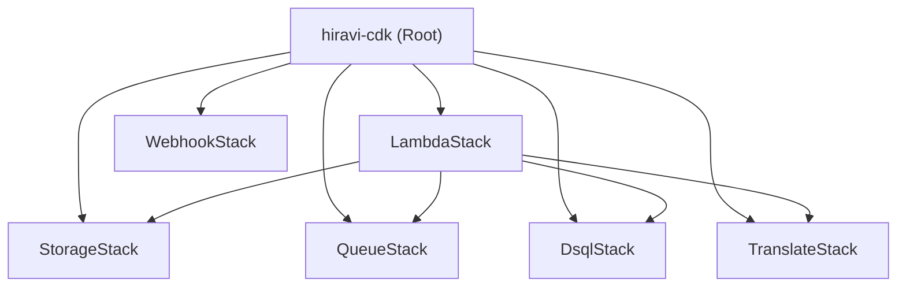

# 依存関係

## 内部依存関係

### パッケージ間の関係
- **LambdaStack** は、S3バケット名やSQSキューURL、DSQLエンドポイントなどの情報を他のスタックから環境変数として受け取る。
- **StorageStack** は、S3の作成イベントを **QueueStack** のSQSキューに通知する。

## 外部依存関係
### AWS SDK (boto3)
- **目的**: AWSサービスへのアクセス
- **ライセンス**: Apache-2.0

### pdf2image / PyMuPDF
- **目的**: PDF処理
- **ライセンス**: MIT / AGPL
